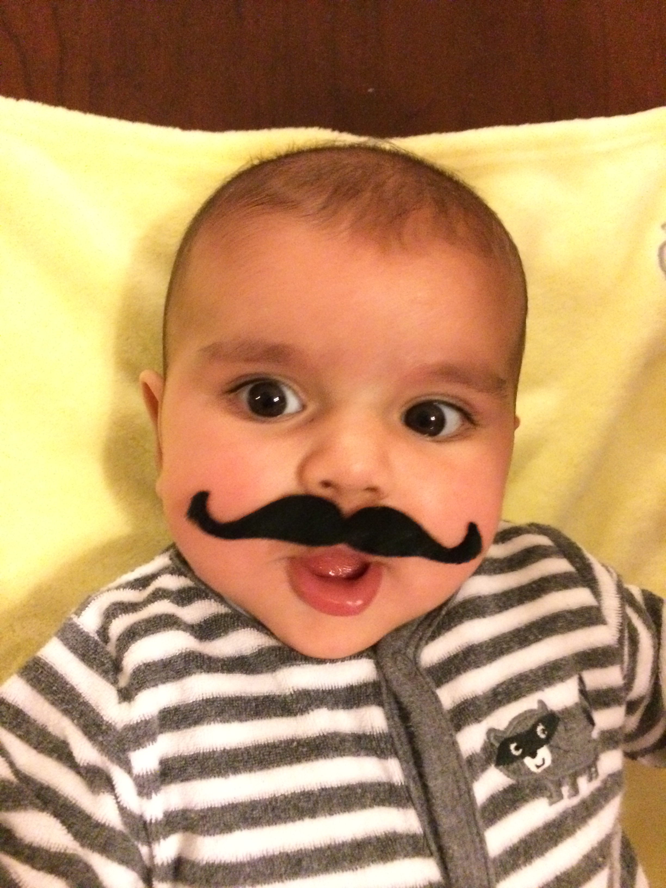
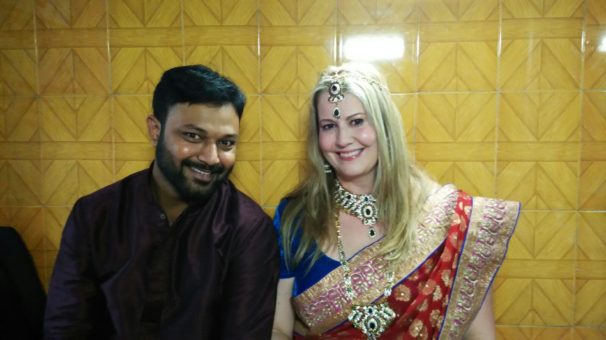
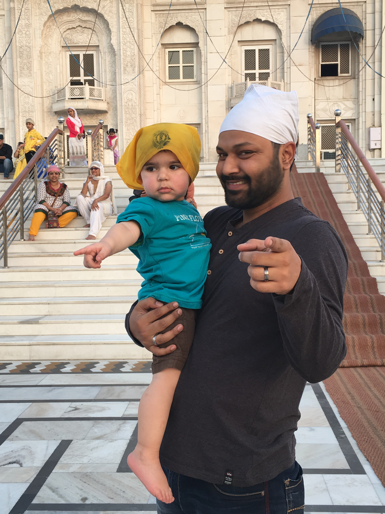
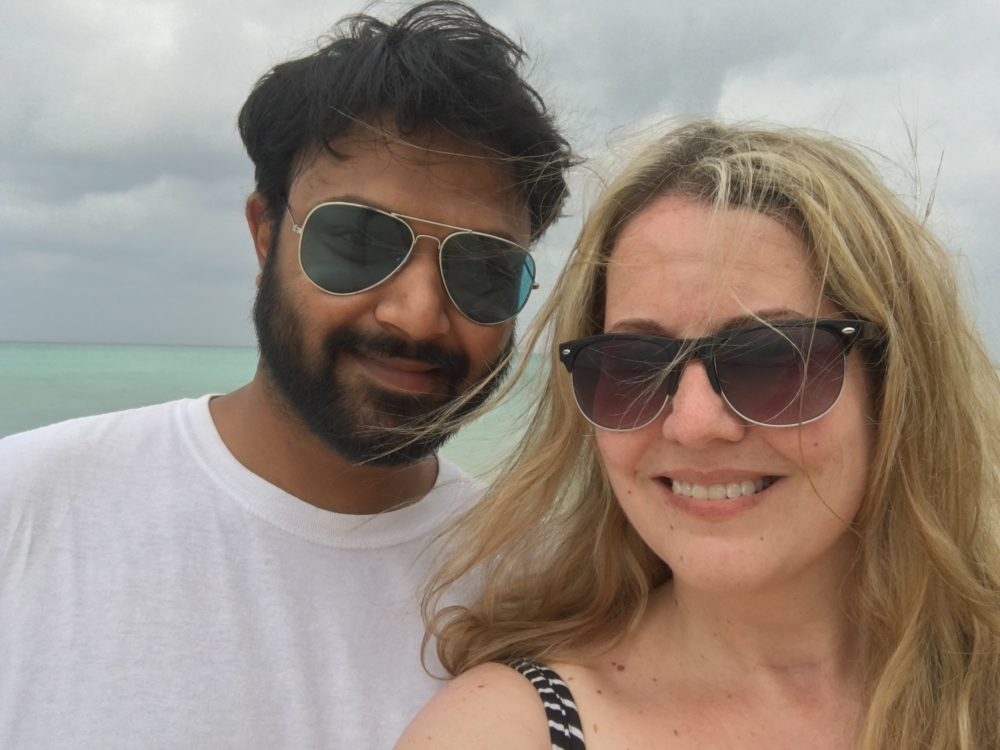
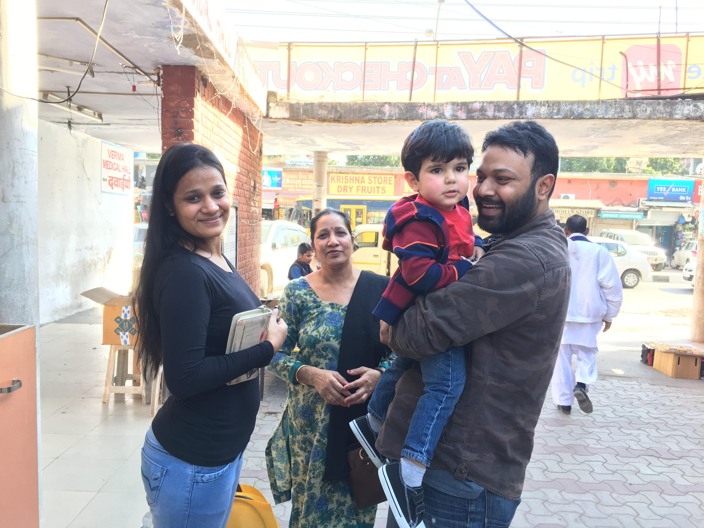
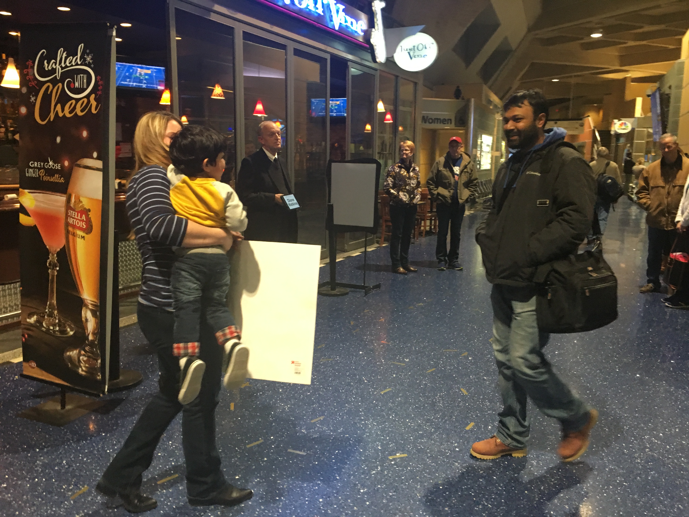

<!DOCTYPE html>

<html>
   <head>
      <title>Adhiraaj Gupta - My journey to US</title>
      <link rel="stylesheet" type="text/css" href="normalize.css">
      <link rel="stylesheet" type="text/css" href="styles.css">
   </head>

   <body id="main-body">
      <header>
      <h1 class = "heading">A long time ago in a country far, far away ....</h1>
      
All this story is missing is a couple of Bollywood numbers with hundreds of dancers in colorful dresses.

      </header>
   <main>
      <article>
      <h2>The beginning</h2>
         

         We met the night of April 25, 2012. Her company had off-shored some of their work to HCL (where I worked)
         in Noida, India (shocking... I know). She was there for 2 weeks for training and support. After she went 
         back to the US, I would contact her via instant messenger at work with process questions. After she answered 
         the question, we would then talk about everyday things. We realized we had a lot in common and pretty 
         soon we were also talking after work via Facebook. Soon we were talking everyday.
         

         <figure>
<<<<<<< HEAD
         
=======
         
>>>>>>> 76740979e06463b6e90baad415b50e3c89d6ffaf
            <figcaption>With the whole team</figcaption>
         </figure>
      <h2>First time together</h2>
         

         She flew to India in 2013 so she could attend the wedding of one of our mutual co-workers. We finally had 
         time to be together and we spent almost the entire time together. I was still working for HCL and since 
         she was considered a client, we had to keep our relationship hidden. That time together is all we needed 
         to know we were in love. A few weeks after she returned home, I found out she was pregnant. Co-workers 
         were already suspecting I was the father due to the timeline and they could see how comfortable we were 
         with each other while she was there. I resigned from my job because of fear of work repercussions from me 
         getting involved with a client.
         

      <h2>The beige bambino</h2>
         

         Our son was born in 2014. When our son was 5 months old, she flew back to India so we could spend another 
         2 weeks together. For this trip we took a bus to my home town of Chandigarh, India so she could meet my 
         family (as a friend) which included my father, mother and sister. We also flew to Assam, India and 
         Kathmandu, Nepal. Our son stayed with her family back in the US. Once she returned home, we realized we 
         wanted to be married and spend our lives together. We always knew we were in love, but we wanted to be 
         100% sure about marriage.
         

         <figure>
         
                  <figcaption>Yup</figcaption>
         </figure>
      <h2>The Elopement</h2>
         

         She flew to India where I got down on one knee and officially proposed. After converting to Hinduism, 
         we eloped and were married in a Hindu Temple in Delhi. Since the wedding was an elopement, it was only 
         attended by the priest and 2 friends. She returned to the US. It wasn't a typical Indan Hindu wedding 
         which last 3 weeks. 
         

         <figure>
         
            <figcaption>A small skinny Indian wedding</figcaption>
         </figure>
      <h2>First time together again</h2>
         

         Our son, her step-mom, and she came to India for a week. We visited monuments such as India Gate, Taj Mahal 
         and Lotus Temple. I loved spending time with our son and being his dad. We were finally able to spend 
         time together as a family. 
         

         <figure>
         
            <figcaption>At a Sikh temple in Delhi</figcaption>
         </figure>
      
      <h2>First vacation</h2>
         

         Her job, Ericsson, sent her back to India for 4 weeks for training. Since I was working in Chandigarh and 
         she was working in Noida, we could only see each other on the weekends. Three of the four weekends, I 
         travelled to Noida to see her. One of those weekends, she took a bus to Chandigarh to see me. On the fifth 
         weekend we finally went on our honeymoon to the Andaman Islands. Her parents and roommate stayed with our 
         son while she was gone. September 2016 her job sent her to India again for 2 weeks for training. I took a bus to 
         see her every weekend. We saw each other for 3 weekends total.
         

         <figure>
         
            <figcaption>Somewhere in the Andaman Islands</figcaption>
         </figure>

      <h2>The family</h2>
         

         In 2016 Halloween and Diwali(Hindus' biggest festival) coincided. The day after that I went to watch a movie with
         my sister and I told her about my wife and son. She said she kinda knew but never mentioned it. That night 
         I told my parents too. They were happy as I was happy, I never expected them to be that cool about it, 
         knowing how Indian parents usually are.
         

      <h2>The Interview</h2>
         

         She flew back to India with our son for my visa interview at the American counsulate in Delhi. They first came 
         to Chandigarh so they could meet my family. She was meeting them for the 2nd time and our son was meeting 
         them for the first time. They stayed with my family for a week and then we went back to Delhi in preparation 
         for the visa interview. The interview itself was easy, it revolved mostly around our son and my relationship
         with him. However sitting and waiting for my call was one of the most uneasy waits for me. I don't remember if I 
         was ever that anxious. Thankfully I had her with me as only the Delhi counsulate allowed the petitioner to come along 
         for a visa interview. Once I was told I had been granted the visa, I was so happy and relieved. We all came back 
         to Chandigarh, stayed with my family for a week more and then they left. I put my notice period in at my job and 
         booked a flight. It as relatively cheap considering it was to reach on December 22nd.  
         

         <figure>
         
            <figcaption>In Chandigarh</figcaption>
         </figure>

      <h2>The Arrival</h2>
         

         Once I reached the US, I was met by my wife and son at the airport. Seeing them washed away all the stress and tiredness of my 36 hours of travel.
         I was welcomed into the family by my MIL, FIL, and SIL and her family.
         It's only been 3 years since I came here, but it feels like I have been here all along.
         

         <figure>
         
            <figcaption>At KCI</figcaption>
         </figure>
      </article>
   </main>
   <footer>
   
&copy; 2019 Adhiraaj Gupta

   </footer>
   </body>
</html>
